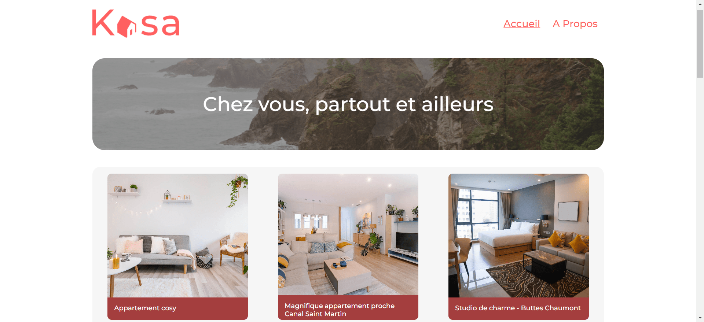

    
  <h3 align="center">Kasa</h3>

##    📋 <a name="table">Summary</a>

- [Introduction](#introduction)
- [Technology Used](#tech-stack)
- [Launch App](#launch-app)

##    <a name="introduction">Introduction</a>

Kasa is a real estate rental web application with React
- Building dynamic and interactive web applications using React.js and other related technologies.
- Implementing responsive design to ensure seamless user experience across all devices.
- Guaranteeing cross-browser compatibility to make my applications accessible on various browsers.
- Utilizing technologies like MongoDB and Express.js to create functional databases for data storage and retrieval.

##    <a name="tech-stack">Technology Used</a>

- **React** is a javaScript library for building user interfaces (UIs). Uses a component-based approach where complex UIs are built from smaller, reusable components. Focuses on the view layer (what the user sees) of a web application.

- **Node.js** is a runtime environment that allows you to execute JavaScript code server-side. It's built on Chrome's V8 JavaScript engine and is widely used for building scalable network applications, APIs, and servers.

- **React-router** is a routing library for React applications that Manages navigation between different views (pages) within the application. Helps keep track of the URL and displays the corresponding component based on the route.

- **Sass** is a preprocessor for CSS that adds features like variables, nesting, mixins, and functions.

- **Styled-component** is a library for styling React components that allows to write CSS directly within your React components using template literals. 

##    <a name="launch-app">Launch App</a>

- clone the repositery
- install node_module: npm i or yarn i
- launch app: npm i or yarn start